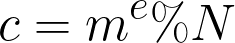
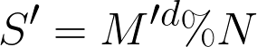

# Blinding Attack on RSA Digital Signatures

## Introduction
RSA security is often excecuted without the knowledge of the user. These automated process are relies on an application of RSA called Digital Signatures. Basically when Alice encrypts a msg with Bob's public key, only Bob can decrypt the message. This proof of identity is called Digital Signatures. Often Bob sets up defences so that he doesn't sign some dangerous messages sent by Marvin ([Someone pretending to be Alice](https://en.wikipedia.org/wiki/Man-in-the-middle_attack)). But Blinding Attack utilises another property of RSA to bypass these defences.

 

## Digital Signatures
Digital Signatures usually works in three steps:-
1. Alice sends a message M (M < N) to Bob.
2. Bob checks if the message falls within his defencive rules and signs the message (C = M&#x1D48; % N) and sends it back to Alice.

  

3. Alice decrypts the message (M = C&#x1D49; % N) and checks if the returned message is the same as the one she sent.

  

## Blinding Attack
When Marvin tries to send a message similar to Alices, Bob notices that the message has some dangerous messages in it and refuses to sign the message. But RSA doesn't have any checking mechanisms inherently, these constrains can be bypassed easily. Sometimes just multipling the dangerous message with a prime number would suffice. So Marvin can attempt a Blinding Attack by using the following steps:-
1. Preapre a buffer r&#x1D49; (r = small integer and e = public key) and send messge multiplied with buffer.
    * These buffers are often referred to as Blinding Factors

  

2. Since Bob only checks for certain strings or characters, Marvin's message will be approved because from Bob's perspective, Marvin is sending a random message that don't contain any unwanted text. And bob returns the signed message.

  

3. Now all Marvin has to do is decrypt the message and remove the blinding factor.

  

Here is a small implementation [blinding.py](https://github.com/AlekhAvinash/Writeups/blob/master/RSA/blinding.py).
## Reference: 
- https://crypto.stanford.edu/~dabo/papers/RSA-survey.pdf
- https://masterpessimistaa.wordpress.com/2017/07/10/blinding-attack-on-rsa-digital-signatures/
